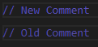

# Change Log

All notable changes to the "sable" extension will be documented in this file.

## [0.1.0] - 2019-06-24

#### Improvement
 * Comments exhibit a better contrast ratio.
 
   

#### Added
 * Preliminary TypeScript support
  
   

## [0.0.2] - 2019-06-23

#### Added
* Extension icon

## [0.0.1] - 2019-06-23

#### Initial release
* Basic Dark+ derived theme with the following changes:
  * ``const`` <small><small>(#b96eb6e5)</small></small> and ``interface`` <small><small>(#F97500)</small></small> have distinct colors in Go.
  * Comments are purple <small><small>(#554ca5)</small></small> rather than green <small><small>(#6A9955)</small></small>.
  * The status bar is a shade of black <small><small>(#0e0e0e)</small></small> rather than the distracting light
  blue <small><small>(#007acc)</small></small>  known from ``Dark+``.